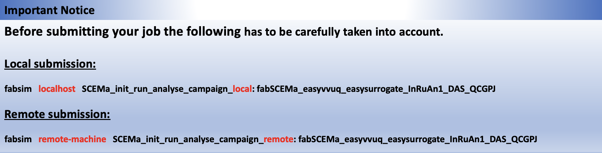

[](https://github.com/UCL-CCS/FabSCEMa/issues)
[](https://github.com/UCL-CCS/FabSCEMa/network)
[](https://github.com/UCL-CCS/FabSCEMa/stargazers)


# FabSCEMa
<br>
 
</br>

FabSCEMa brief overview
-----------------------

The FabSCEMa tool in combination with an existing platform for verification, validation, and uncertainty quantification [SEAVEA toolkit (https://www.seavea-project.org/seaveatk/)] offers a scientific simulation environment and data processing workflows that enable the execution of single and ensemble simulations. This Fabsim-plugin also supports the execution of remotely or locally submitted jobs through the plugin and helps the experts to do several specific annalistic tasks on a local machine or on a cluster or supercomputing platform within the EasyVVUQ and EasySurrogate architectures. It is a fully automated computational tool for the study of the uncertainty in a computational model of a heterogeneous multi-scale atomistic continuum coupling system, a publicly available open-source code SCEMa (https://GitHub.com/UCL-CCS/SCEMa).

For the full FabSCEMa documentation, please visit https://fabscema.readthedocs.io


# How to run a SCEMa (test) Job

These examples assume that you have been able to run the basic FabSim examples described in the other documentation files, and that you have built and configured SCEMa (https://github.com/UCL-CCS/SCEMa) on the target machine.

Two minimal examples of  SCEMa simulation are provided in ``config_files/SCEMa_test1`` and  ``config_files/SCEMa_test2`` to execute these examples type:

``fabsim localhost SCEMa:SCEMa_test1``

``fabsim localhost SCEMa:SCEMa_test2``

# Run Ensemble Examples

### SCEMa_ensemble_example1

These examples assume that you have been able to run the basic FabSim examples described in the other documentation files, and that you have built and configured SCEMa (https://github.com/UCL-CCS/SCEMa) on the target machine.

To run type:
```
fabsim localhost SCEMa_ensemble:SCEMa_ensemble_example1
```
This example runs 3 simulations with different input files, which vary the simulation temperature, using the same topology file.


### SCEMa_ensemble_example2

This example runs 6 simulations with different input files, which vary the simulation timestep, using the same topology file.

To run type:
```
fabsim localhost  SCEMa_ensemble:SCEMa_ensemble_example2
```
## EasyVVUQ+FabSCEMa 
After updating the following files with your credentials

```
  -FabSim3/deploy/machines_user.yml
  -FabSim3/deploy/machines.yml
  -FabSim3/plugins/FabSCEMa/machines_FabSCEMa_user.yml
  
```

run the following:

```
  -  fabsim   localhost   SCEMa_init_run_analyse_campaign_local:fabSCEMa_easyvvuq_InRuAn1_QCGPJ
  -  fabsim   <remote machine name>   SCEMa_init_run_analyse_campaign_remote:fabSCEMa_easyvvuq_InRuAn1_QCGPJ

```

and copy the results back to your local machine with

```
 -  fabsim  localhost   fetch_results
 -  fabsim  <remote machine name>   fetch_results
```
## EasyVVUQ+EasySurrogate+FabSCEMa 
After updating the following files with your credentials

```
  -FabSim3/deploy/machines_user.yml
  -FabSim3/deploy/machines.yml
  -FabSim3/plugins/FabSCEMa/machines_FabSCEMa_user.yml
  
```

run the following:

```
  -  fabsim   localhost   SCEMa_init_run_analyse_campaign_local:fabSCEMa_easyvvuq_easysurrogate_InRuAn1_DAS_QCGPJ
  -  fabsim   <remote machine name>   SCEMa_init_run_analyse_campaign_remote:fabSCEMa_easyvvuq_easysurrogate_InRuAn1_DAS_QCGPJ
  -  fabsim   localhost   SCEMa_init_run_analyse_campaign_local:fabSCEMa_easyvvuq_easysurrogate_InRuAn2_DAS_QCGPJ
  -  fabsim   <remote machine name>   SCEMa_init_run_analyse_campaign_remote:fabSCEMa_easyvvuq_easysurrogate_InRuAn2_DAS_QCGPJ

```

and copy the results back to your local machine with

```
 -  fabsim  localhost   fetch_results
 -  fabsim  <remote machine name>   fetch_results
```

<p align="center" width="100%">
 
</p> 
