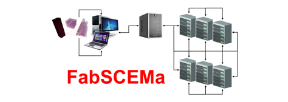

# FabSCEMa
<br>
 
</br>

# How to run a SCEMa (test) Job

These examples assume that you have been able to run the basic FabSim examples described in the other documentation files, and that you have built and configured SCEMa (https://github.com/UCL-CCS/SCEMa) on the target machine.

Two minimal examples of  SCEMa simulation are provided in ``config_files/SCEMa_test1`` and  ``config_files/SCEMa_test2`` to execute these examples type:

``fabsim localhost SCEMa:SCEMa_test1``

``fabsim localhost SCEMa:SCEMa_test2``

# Run Ensemble Examples

### SCEMa_ensemble_example1

These examples assume that you have been able to run the basic FabSim examples described in the other documentation files, and that you have built and configured SCEMa (https://github.com/UCL-CCS/SCEMa) on the target machine.

To run type:
```
fabsim localhost SCEMa_ensemble:SCEMa_ensemble_example1
```
This example runs 3 simulations with different input files, which vary the simulation temperature, using the same topology file.


### SCEMa_ensemble_example2

This example runs 6 simulations with different input files, which vary the simulation timestep, using the same topology file.

To run type:
```
fabsim localhost  SCEMa_ensemble:SCEMa_ensemble_example2
```
## EasyVVUQ+FabSCEMa 
After updating the following files with your credentials

```
  -FabSim3/deploy/machines_user.yml
  -FabSim3/deploy/machines.yml
  -FabSim3/plugins/FabSCEMa/machines_FabSCEMa_user.yml
  
```

run the following:

```
  -  fabsim   localhost   SCEMa_init_run_analyse_campaign_local:fabSCEMa_easyvvuq_InRuAn1_QCGPJ
  -  fabsim   <remote machine name>   SCEMa_init_run_analyse_campaign_remote:fabSCEMa_easyvvuq_InRuAn1_QCGPJ

```

and copy the results back to your local machine with

```
 -  fabsim  localhost   fetch_results
 -  fabsim  <remote machine name>   fetch_results
```
## EasyVVUQ+EasySurrogate+FabSCEMa 
After updating the following files with your credentials

```
  -FabSim3/deploy/machines_user.yml
  -FabSim3/deploy/machines.yml
  -FabSim3/plugins/FabSCEMa/machines_FabSCEMa_user.yml
  
```

run the following:

```
  -  fabsim   localhost   SCEMa_init_run_analyse_campaign_local:fabSCEMa_easyvvuq_easysurrogate_InRuAn1_DAS_QCGPJ
  -  fabsim   <remote machine name>   SCEMa_init_run_analyse_campaign_remote:fabSCEMa_easyvvuq_easysurrogate_InRuAn1_DAS_QCGPJ
  -  fabsim   localhost   SCEMa_init_run_analyse_campaign_local:fabSCEMa_easyvvuq_easysurrogate_InRuAn2_DAS_QCGPJ
  -  fabsim   <remote machine name>   SCEMa_init_run_analyse_campaign_remote:fabSCEMa_easyvvuq_easysurrogate_InRuAn2_DAS_QCGPJ

```

and copy the results back to your local machine with

```
 -  fabsim  localhost   fetch_results
 -  fabsim  <remote machine name>   fetch_results
```


