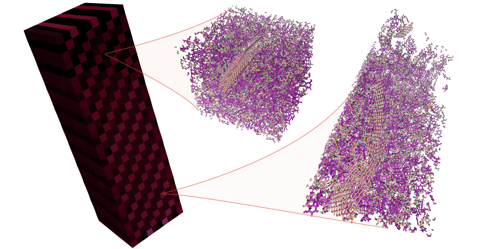
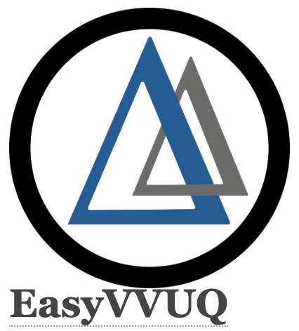

.. _installation:

.. Installation
.. ============

SCEMa configuration and build
===================

In the following we will provide an example on how to configure and build SCEMa on a remote machine.

SCEMa on ARCHER2
===================

After being successfully logged into the cluster, first load the following modules:

    .. code-block:: console
		
		module swap PrgEnv-cray PrgEnv-gnu
                module load cmake cray-python 
		module load cray-fftw

Then enter the work directory (/work) and download  petsc, dealii and lammps code into some folders

    .. code-block:: console
		
		wget https://ftp.mcs.anl.gov/pub/petsc/release-snapshots/petsc-3.16.2.tar.gz
                wget https://github.com/dealii/dealii/releases/download/v9.0.1/dealii-9.0.1.tar.gz
		wget https://download.lammps.org/tars/lammps-17Nov2016.tar.gz

After the codes are cloned, unpack them
    .. code-block:: console
		
		tar -xvf petsc-3.16.2.tar.gz
                tar -xvf dealii-9.0.1.tar.gz
                tar -xvf lammps-17Nov2016.tar.gz

Build petsc
-----------

From within the petsc directory, run the following configure command
    .. code-block:: console
		
	./configure --with-cc=cc --with-cxx=CC --with-fc=ftn
	
And then build petsc
    .. code-block:: console
		
	make PETSC_DIR=/work/yours/petsc-3.16.2 PETSC_ARCH=arch-linux-c-debug all
	make PETSC_DIR=/work/yours/petsc-3.16.2 PETSC_ARCH=arch-linux-c-debug check
	
Build deal.II
-------------

From within the deal.II directory, run the following configure command
    .. code-block:: console
    
	mkdir /work/yours/bin/deal.II	
	CC=cc CXX=CC FC=ftn cmake -DCMAKE_INSTALL_PREFIX=/work/yours/bin/deal.II -DDEAL_II_WITH_MPI=ON -DDEAL_II_WITH_PETSC=ON -DPETSC_DIR=/work/yours/petsc-3.16.2 -DPETSC_ARCH=arch-linux-c-debug  -DDEAL_II_WITH_LAPACK=OFF ..
	
And then build deal.II
    .. code-block:: console
		
	make install (make -j 4 install)
	make test
	

All can be done using a job script, which might look like the following

           .. code-block:: bash
	   
                     #!/bin/bash

                     #SBATCH --job-name=build
                     #SBATCH --nodes=1
                     #SBATCH --tasks-per-node=128
                     #SBATCH --cpus-per-task=1
                     #SBATCH --time=5:05:00

                     #SBATCH --account=yours
                     #SBATCH --partition=standard
                     #SBATCH --qos=standard
 
                     # modules
                     module swap PrgEnv-cray PrgEnv-gnu
                     module load cmake cray-python
		     module load cray-fftw

                     echo $SLURM_SUBMIT_DIR

                     # Download
                     wget https://ftp.mcs.anl.gov/pub/petsc/release-snapshots/petsc-3.16.2.tar.gz
                     wget https://github.com/dealii/dealii/releases/download/v9.0.1/dealii-9.0.1.tar.gz
                     wget https://download.lammps.org/tars/lammps-17Nov2016.tar.gz

                     # Unpack
                     tar -xvf petsc-3.16.2.tar.gz
                     tar -xvf dealii-9.0.1.tar.gz
                     tar -xvf lammps-17Nov2016.tar.gz

                     # Build PETSc
                     cd /work/yours/petsc-3.16.2
                     ./configure --with-cc=cc --with-cxx=CC --with-fc=ftn
                     make PETSC_DIR=/work/yours/petsc-3.16.2 PETSC_ARCH=arch-linux-c-debug all
                     make PETSC_DIR=/work/yours/petsc-3.16.2 PETSC_ARCH=arch-linux-c-debug check
                     cd ..

                     # Build deal.II
		     mkdir /work/yours/bin/deal.II
                     cd /work/yours/dealii-9.0.1/build
                     CC=cc CXX=CC FC=ftn cmake -DCMAKE_INSTALL_PREFIX=/work/yours/bin/deal.II -DDEAL_II_WITH_MPI=ON -DDEAL_II_WITH_PETSC=ON -    
		     DPETSC_DIR=/work/yours/petsc-3.16.2 -DPETSC_ARCH=arch-linux-c-debug  -DDEAL_II_WITH_LAPACK=OFF ..
                     make install
                     make test
                     cd ../..	

Build LAMMPS
------------

From within the LAMMPS directory, move to the src/ directory
    .. code-block:: console
		
	create MAKE/MACHINE/Makefile.archer2
	cp MAKE/Makefile.mpi MAKE/MACHINES/Makefile.archer2
	
Then edit the following in MAKE/MACHINES/Makefile.archer2 (e.g. nano MAKE/MACHINES/Makefile.archer2)
    .. code-block:: console
		
	CC =		CC
        CCFLAGS =	-O3 -Wrestrict
        LINK =.         CC
        LINKFLAGS =.    -O
        LIB = 		-lstdc++
        LMP_INC =	-DLAMMPS_GZIP
        MPI_INC =       -DMPICH_SKIP_MPICXX
        FFT_INC=        -DFFT_FFTW3
        FFT_LIB=        -lfftw3
		 
And then build LAMMPS 
    .. code-block:: console
		
        make yes-RIGID
        make yes-USER-REAXC
        make yes-asphere yes-body yes-class2
        make yes-colloid yes-compress
        make yes-coreshell yes-dipole yes-granular
        make yes-kspace yes-manybody yes-mc
        make yes-misc yes-molecule yes-opt
        make yes-peri yes-qeq yes-replica
        make yes-rigid yes-shock yes-snap
        make yes-srd 
	
	make -j 8 archer2
	make mode=print serial
        make mode=shlib
        make mode=shlib archer2
	

This will create the lmp_archer2 executable. For more detailed approach please visit:
    .. code-block:: console
		
		https://github.com/hpc-uk/build-instructions/blob/main/apps/LAMMPS/build_lammps_15Oct2020_gcc930.md
		
		
Build SCEMa
------------
Within the work directory (/work) clone SCEMa

    .. code-block:: console
          
	  git clone https://github.com/UCL-CCS/SCEMa.git

From within the SCEMa directory, run the following commands
    .. code-block:: console
		
	mkdir build
	cp CMakeLists/example_machine.CMakeLists.txt CMakeLists.txt
	
Where the file CMakeLists.txt needs to be edited to point toward the right installation path, which might look like the following

           .. code-block:: bash
	   
                       CMAKE_MINIMUM_REQUIRED(VERSION 3.21)

                       set(CMAKE_C_COMPILER "cc")
                       set(CMAKE_CXX_COMPILER "CC")

                       PROJECT(dealammps LANGUAGES CXX)

                       FIND_PACKAGE(deal.II 9.0.1 REQUIRED
                       HINTS /work/yours/bin/deal.II
                           )
                       DEAL_II_INITIALIZE_CACHED_VARIABLES()

                       ADD_EXECUTABLE(dealammps dealammps.cc)
                       DEAL_II_SETUP_TARGET(dealammps)

                       INCLUDE_DIRECTORIES(
                       /work/yours/lammps-17Nov16/src
                       /opt/cray/pe/python/default/include/python3.8
                       )

                       TARGET_LINK_LIBRARIES(dealammps /work/yours/lammps-17Nov16/src/liblammps.so)
                       TARGET_LINK_LIBRARIES(dealammps /opt/cray/pe/python/default/lib/libpython3.8.so)

                       TARGET_LINK_LIBRARIES(dealammps LINK_PUBLIC ${Boost_LIBRARIES})
		 
		 
Then run the following commands
     .. code-block:: console
     
	(/work/yours/bin/deal.II must exist!)
	cd build
	cmake -DDEAL_II_DIR=/work/yours/bin/deal.II ../
	
Finally build SCEMa
    .. code-block:: console
		
	make dealammps

This will create the dealammps executable. For more detailed approach please visit:
    .. code-block:: console
		
		https://github.com/UCL-CCS/SCEMa	   

FabSCEMa Installation
==================
.. image:: ../../FabSCEMa_logo.png
   :alt: FabSCEMa
   :target: https://github.com/UCL-CCS/FabSCEMa
   :class: with-shadow
   :scale: 60

Before being able to run FabSCEMa [with the assumption that you have been able to run the basic FabSim examples described in the other documentation files, and that you have configured and built SCEMa (https://github.com/UCL-CCS/SCEMa) on the target machine, and  successfully tested the executable code!], you should install FabSCEMa inside of FabSim3. This will  provide functionality to extend FabSim3's workflow and remote submission capabilities to SCEMa specific tasks. 

* To install FabSim3 tool, please follow the installation from https://fabsim3.readthedocs.io/en/latest/installation.html

* To install FabSCEMa plugin, simply type:

    .. code-block:: console
		
		fabsim localhost install_plugin:FabSCEMa
		
		
After installation of FabSCEMa the following need to be done.

Custom Environments 
==================

Regardless of the existing python environment on the HPC/local system, you need to setup a custom Python environment including packages that are not in the central installation, the simplest approach here would be the installation of Miniconda locally in your own directories.

Installing Miniconda
==================
.. image:: ../../images/ac.png
   :alt: Miniconda
   :target: https://docs.conda.io/en/latest/miniconda.html
   :class: with-shadow
   :scale: 30

First, you should download Miniconda (links to the various miniconda versions on the Miniconda website: https://docs.conda.io/en/latest/miniconda.html)

.. Note:: If you wish to use Python on the Archer2's compute nodes then you must install Miniconda in your /work directories as these are the only ones visible on the compute nodes.

Once you have downloaded the installer, you can run it. 
For example:

    .. code-block:: console
		
		user@login*:~> bash Miniconda3-latest-Linux-x86_64.sh
		
After you have installed Miniconda and setup your environment to access it, you can install whatever packages you wish using the conda install ... command. 
For example: 
    .. code-block:: console
		
		(base)user@login*:~> conda install somepy
		
		
Installing EasyVVUQ
==================

		
Next you need to install EasyVVUQ in your Miniconda environment to access it.
You can install EasyVVUQ using:
    .. code-block:: console
		
		(base)user@login*:~> pip install easyvvuq

and upgrade the library using:
    .. code-block:: console
		
		(base)user@login*:~> pip install easyvvuq --upgrade

Where (base) can be replaced with your new conda environment

For more detailed approach please visit:
    .. code-block:: console
		
		https://github.com/UCL-CCS/EasyVVUQ

Installing EasySurrogate
==================		
		
Next you need to install EasySurrogate in your Miniconda environment to access it.
You can install EasyVVUQ using:
    .. code-block:: console
		
		(base)user@login*:~> pip install easysurrogate

Where (base) can be replaced with your new conda environment

For more detailed approach please visit:
    .. code-block:: console
		
		https://github.com/wedeling/EasySurrogate
		
		
Installing FabSim3
==================

Next you need to install FabSim3 somewhere in your directories and your Miniconda environment to access it.

First you need to check if the following Python modules are already installed

    .. code-block:: console
		
		fabric3==1.13.1.post1
		PyYAML
		numpy
		ruamel.yaml
		rich

Then install both ruamel.yaml and rich package

    .. code-block:: console
		
		pip3 install ruamel.yaml rich

Once you have installed the required packages, then clone FabSim3 from the GitHub repository:

    .. code-block:: console
		
		git clone https://github.com/djgroen/FabSim3.git
		
Finally change to your FabSim3 directory, and type		

    .. code-block:: console
		
		(base)user@login*:~>python3 configure_fabsim.py

Where (base) can be replaced with your new conda environment

For more detailed approach please visit:
    .. code-block:: console
		
		https://github.com/djgroen/FabSim3

Installing QCG-PilotJob
==================

Next you need to install QCG-PilotJob somewhere in your Miniconda environment to access it.

You can install QCG-PilotJob using:
    .. code-block:: console
		
		(base)user@login*:~> pip install qcg-pilotjob

and supplementary packages can be installed using:
    .. code-block:: console
		
		(base)user@login*:~> pip install qcg-pilotjob-cmds
		(base)user@login*:~> pip install qcg-pilotjob-executor-api

Where (base) can be replaced with your new conda environment

For more detailed approach please visit:
    .. code-block:: console
		
		https://github.com/vecma-project/QCG-PilotJob

Creating virtual environment
==================

Finally you need to create a new virtual environment, and update the following files:

    .. code-block:: console
		
		easyvvuq_SCEMa_RUN_remote.py
                easyvvuq_SCEMa_RUN_localhost.py
		SCEMa_easyvvuq_init_run_analyse_local.py
		SCEMa_easyvvuq_init_run_analyse_remote.py
		SCEMa_init_run_analyse_campaign_local
		SCEMa_init_run_analyse_campaign_remote

which are found in 

``plugins/FabSCEMa/config_files/fabSCEMa_easyvvuq_InRuAn*_QCGPJ``
``plugins/FabSCEMa/config_files/fabSCEMa_easyvvuq_easysurrogate_InRuAn*_DAS_QCGPJ``   
``plugins/FabSCEMa/config_files/fabSCEMa_easyvvuq_easysurrogate_InRuAn_GP_QCGPJ``
``plugins/FabSCEMa/config_files/fabSCEMa_easyvvuq_easysurrogate_InRuAn_QSN_QCGPJ``
``plugins/FabSCEMa/templates``

This environment is used by EasyVVUQ campaign. For example if you want to execute the SCEMa jobs on a remote machine do only the following:

First, open the file "SCEMa_easyvvuq_init_run_analyse_remote.py" and modify it to your virtual environment

     .. code-block:: console
     
                       ...
                       with QCGPJPool(template_params={'venv': '/mnt/lustre/a2fswork2/work/e723/e723/kevinb/venv_kevin'}) as qcgpj:
                       campaign.execute(pool=qcgpj).collate(progress_bar=True)
                       ...

and then open  "FabSCEMa/templates/SCEMa_init_run_analyse_campaign_remote" and modify it to your python environment

     .. code-block:: console
     
                       ...
                       /mnt/lustre/a2fs-work2/work/e723/e723/kevinb/miniconda3/envs/py38/bin/python3.8     SCEMa_easyvvuq_init_run_analyse_remote.py                              $machine_name    '$run_command_SCEMa'   $SCEMa_exec
                       ...

.. Note:: If you  want to run FabSCEMa on your local machine and execute the SCEMa jobs on a remote machine (e.g. fabsim  archer2 ...), you need to have the virtual environment on remote machine and you only need to have FabSCEMa installed on your local macchine (no need for installation of FabSCEMa on a remote machine!)

You can install virtualenv using:
    .. code-block:: console
		
		curl https://bootstrap.pypa.io/get-pip.py -o get-pip.py
                python3 get-pip.py --user
                pip install --user virtualenv
		
		
Then to create private virtual environment type:
    .. code-block:: console
		
		virtualenv venv
                . venv/bin/activate	
		
Once you have installed the required packages and created virtual environment, then install QCG-PilotJob using:

    .. code-block:: console
		
		pip install qcg-pilotjob

and supplementary packages can be installed using:
    .. code-block:: console
		
		pip install qcg-pilotjob-cmds
		pip install qcg-pilotjob-executor-api

		
For more detailed approach please visit:
    .. code-block:: console
		
		https://qcg-pilotjob.readthedocs.io/en/develop/installation.html
