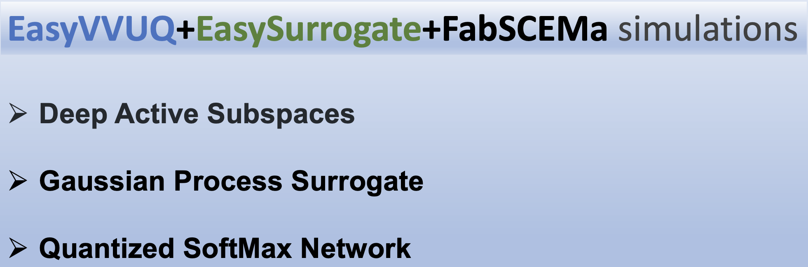
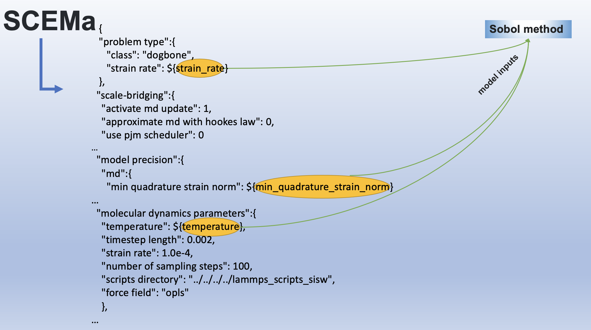
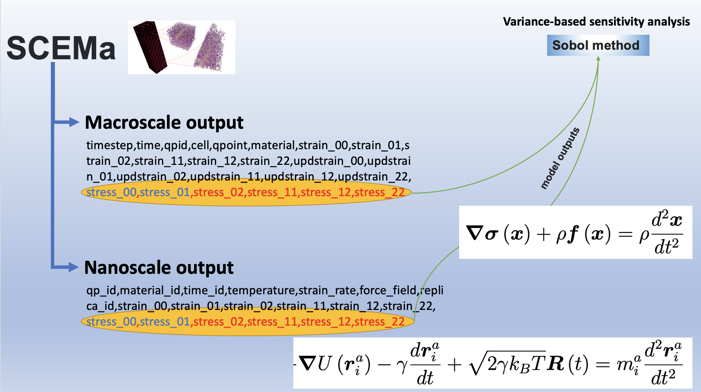
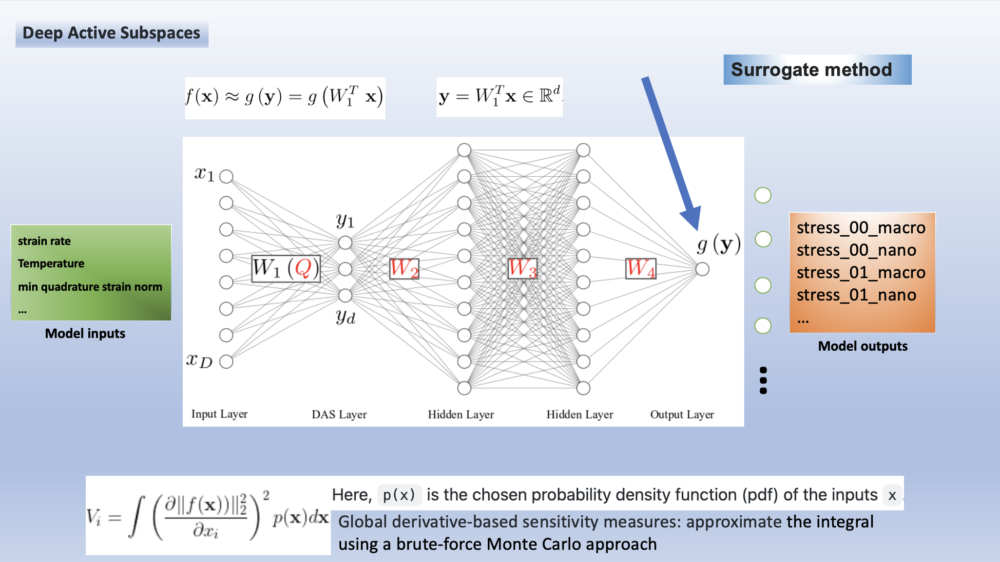
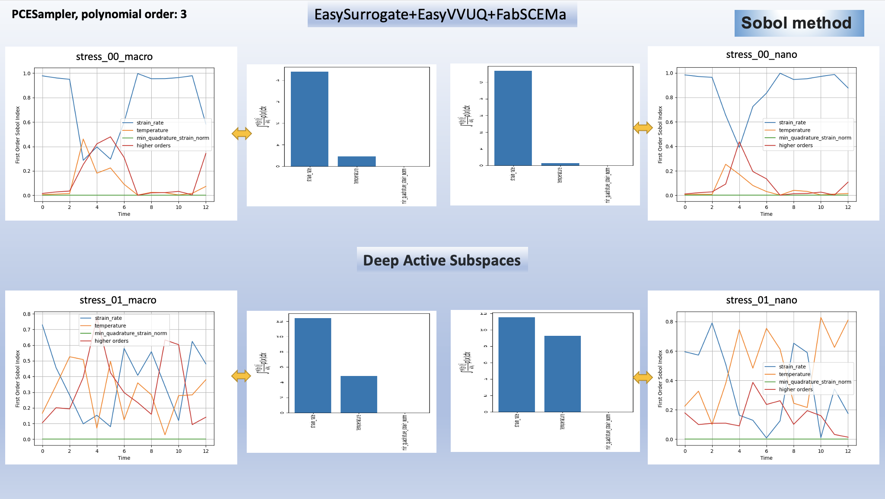
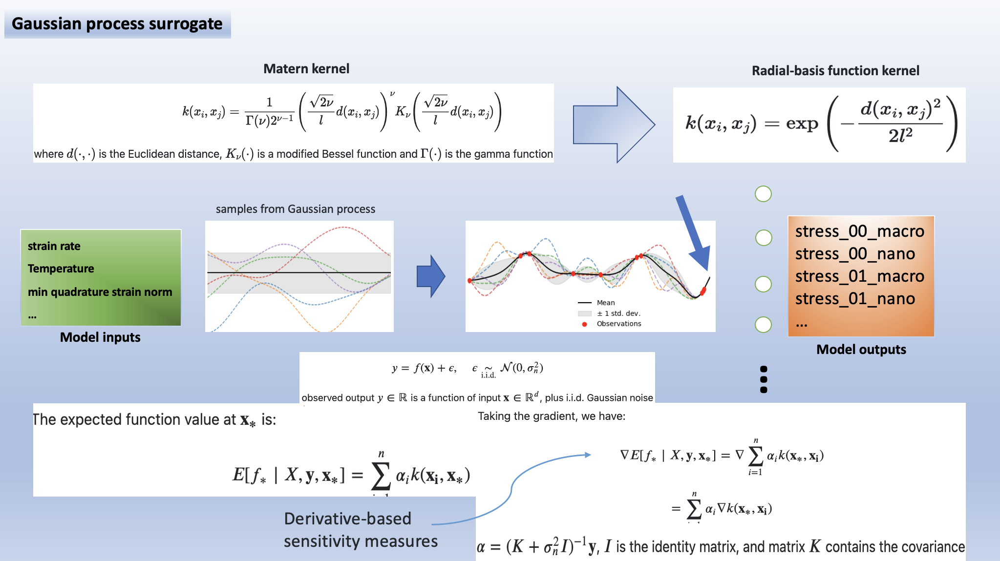
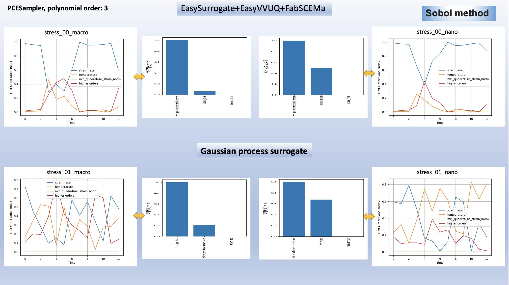
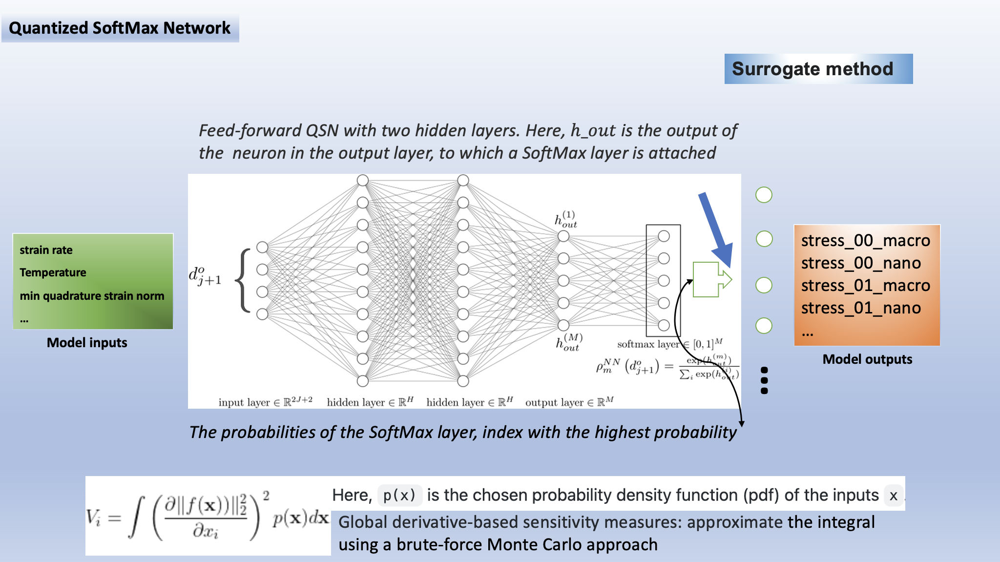
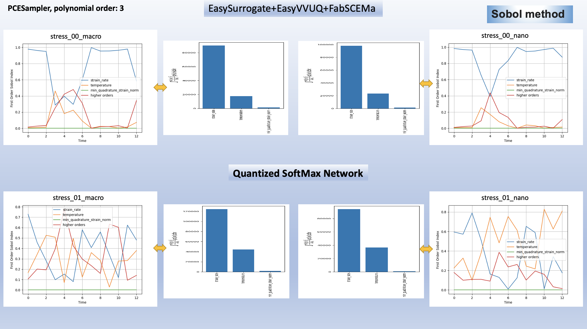
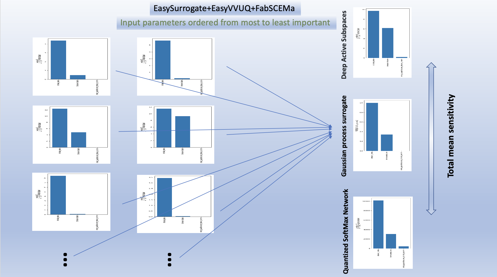

.. _workflow:

FabSCEMa Workflow
==============

Introduction
------------
The FabSCEMa tool in combination with an existing platform for verification, validation, and uncertainty quantification offers a scientific simulation environment and data processing workflows that enable the execution of single and ensemble simulations. This Fabsim-plugin also supports the execution of remotely or locally submitted jobs through the plugin and helps the experts to do several specific annalistic tasks on a local machine or on a cluster or supercomputing platform within the EasyVVUQ and EasySurrogate architectures. It is a fully automated computational tool for the study of the uncertainty in a computational model of a heterogeneous multi-scale atomistic continuum coupling system, a publicly available open-source code SCEMa (https://GitHub.com/UCL-CCS/SCEMa).

Example of workflow for FabSCEMa
------------------------------------------------------------------
An already implemented example from FabSCEMa's project will be explained in the following. 

SCEMa (Simulation Coupling Environment for Materials)
-----------------------------------------------------
Mechanisms emerging across multiple scales are ubiquitous in physics and methods designed to investigate them are becoming essential. The heterogeneous multiscale method (HMM) is one of these, concurrently simulating the different scales while keeping them separate. Due to the significant computational expense, developments of HMM remain mostly theoretical and applications to physical problems are scarce. However, HMM is highly scalable and is well suited for high performance computing. With the wide availability of multi-petaflop infrastructures, HMM applications are becoming practical. Rare applications to mechanics of materials at low loading amplitudes exist, but are generally confined to the elastic regime. Beyond that, where history-dependent, irreversible or non-linear mechanisms occur, not only computational cost, but also data management issues arise. The microscale description loses generality, developing a specific microstructure based on the deformation history, which implies inter alia that as many microscopic models as discrete locations in the macroscopic description must be simulated and stored. Here we present a detailed description of the application of HMM to inelastic mechanics of materials, with emphasis on the efficiency and accuracy of the scale bridging methodology. The method is well-suited to the estimation of macroscopic properties of polymers (and derived nanocomposites) starting from knowledge of their atomistic chemical structure. Through application of the resulting workflow to polymer fracture mechanics, we demonstrate deviation in the predicted fracture toughness relative to a single scale molecular dynamics approach, thus illustrating the need for such concurrent multiscale methods in the predictive estimation of
macroscopic properties.

.. image:: ../../images/scema.png
   :align: center
   :class: with-shadow
   :scale: 50

Further information can be found in the following publication.

References
    .. code-block:: console
		
		Vassaux, M., Richardson, R. A., & Coveney, P. V. (2019). The heterogeneous multiscale method applied to inelastic polymer mechanics. Philosophical Transactions of the Royal Society A, 377(2142), 20180150.
    
    
Submitting  job
------------------------------------------------------------------

Before submitting the simulation to a remote machine, two YAML files must be edited. First we need to modify the file

      .. code-block:: yaml
      
           FabSim3/deploy/machines_user.yml 

and add the login credentials in the template so that FabSCEMa knows where to run the simulation. 
The following example shows what parameters (username, project, budget and sshpass) need to be defined for a remote machine name ARCHER2 (the UK National Supercomputer). Other machines may have more or less parameters that need to be defined.

	.. code-block:: yaml
	
                  archer2:		
                         username: "<your-username>"
                         project: "e123"
                         budget: "e123-user"
                         sshpass: "<ARCHER2-password>"
                         manual_sshpass: true

The next important file that needs to be updated is 

        .. code-block:: yaml
	
              FabSim3/plugins/FabSCEMa/machines_FabSCEMa_user.yml 

In this file you can set the path to the SCEMa executable on the remote machine which is dealammps and the input file names (e.g. inputs.json), and the remote run command. Here we assume that you have been able to run the basic FabSim examples described in the other documentation files, and that you have configured and built SCEMa on the target machine, and successfully tested the executable code!. For example, for archer2 (remote machine) it might look like:

	.. code-block:: yaml

		archer2:
		       
                   SCEMa_exec: "/mnt/lustre/a2fs-work2/work/e723/e723/kevinb/SCEMa/build/dealammps"

		   ...
		   SCEMa_params:
                         SCEMa_input: "inputs.json"
                         sweep_dir_name: "SWEEP"

                   ...
                   run_command_SCEMa: "srun --nodes=1 --ntasks=1 --exclusive --oversubscribe --mem=5500M"
		   ...
		   ...
		   ...
		   modules:
		      loaded: ["python"]

After all the above configurations done we still would need to update ``FabSim3/fabsim/deploy/templates``. For example, the template (slurm-archer2) for archer2  might look like:

           .. code-block:: bash
	   
	         #!/bin/bash
                 ## slurm-archer2
                 ## number of nodes
                 #SBATCH --nodes 70

                 ## SBATCH --nodes $nodes
                 #SBATCH --ntasks=8960
                 ## task per node
                 #SBATCH --tasks-per-node=$corespernode
                 #SBATCH --cpus-per-task=1
                 ## wall time in format MINUTES:SECONDS
                 #SBATCH --time=$job_wall_time

                 ## grant
                 #SBATCH --account=$budget

                 ## stdout file
                 #SBATCH --output=$job_results/JobID-%j.output

                 ## stderr file
                 #SBATCH --error=$job_results/JobID-%j.error

                 #SBATCH --partition=$partition_name
                 #SBATCH --qos=$qos_name

                 export OMP_NUM_THREADS=1
                 export FI_MR_CACHE_MAX_COUNT=0
                 export PATH="/mnt/lustre/a2fs-work2/work/e723/e723/kevinb/miniconda3/bin:$PATH"
                 export PATH="/mnt/lustre/a2fs-work2/work/e723/e723/kevinb/.local/.local/bin:$PATH" 
                 export LD_LIBRARY_PATH=/opt/gcc/10.2.0/snos/lib64:$LD_LIBRARY_PATH
                

Once all has been done, we can submit a simulation to a remote machine using the command:

    .. code-block:: console
		
		fabsim archer2 SCEMa:SCEMa_test1	

and copy the results back to our local machine with

    .. code-block:: console
		
		fabsim  archer2  fetch_results
		
		
Practical Illustration
==============	

In the following we will provide a step-by-step demonstration of how to perform a job submission and also we will demonstrate the output of analysis.

step one
--------

Specific set of tasks required before submitting the job onto the remote/local machine. Two input files that are found in:

      .. code-block:: console
      
             plugins/FabSCEMa/config_files/fabSCEMa_easyvvuq_InRuAn*_QCGPJ
	     plugins/FabSCEMa/config_files/fabSCEMa_easyvvuq_InRuAn*_dask
	     plugins/FabSCEMa/config_files/fabSCEMa_easyvvuq_InRuAn*_ThreadPoolExecutor
	     plugins/FabSCEMa/config_files/fabSCEMa_easyvvuq_easysurrogate_InRuAn*_DAS_QCGPJ
	     plugins/FabSCEMa/config_files/fabSCEMa_easyvvuq_easysurrogate_InRuAn_GP_QCGPJ
	     plugins/FabSCEMa/config_files/fabSCEMa_easyvvuq_easysurrogate_InRuAn_QSN_QCGPJ
	     

are the most important files which can be modified for your own specific purpose.

``SCEMa_remote.template`` file:
---------------------------------------
 
    .. code-block:: console
		
		[SCEMa_remote.template] It is the SCEMa input script in fabSCEMa_easyvvuq_easysurrogate_InRuAn* subfolder, EasyVVUQ will substitute certain variables in this file to create the ensemble
 
Here, as shown in the following, strain_rate, min_quadrature_strain_norm and Temperature are selected as model inputs for Variance-based sensitivity analysis (Sobol method)

A working example:

           .. code-block:: bash
             	   
               {
	        "problem type":{
		"class": "dogbone",
		 "strain rate": ${strain_rate}
 	       },
                "scale-bridging":{
                "activate md update": 1,
                "approximate md with hookes law": 0,
                "use pjm scheduler": 0
               },
                "continuum time":{
                "timestep length": 5.0e-7,
                "start timestep": 1,
                "end timestep": 15
               },
                "continuum mesh":{
                "fe degree": 1,
                "quadrature formula": 2,
                "input": {
                   "style" : "cuboid",
                   "x length" : 0.03,
                   "y length" : 0.03,
                   "z length" : 0.08,
                   "x cells" : 1,
                   "y cells" : 1,
                   "z cells" : 2
               }
               },
               "model precision":{
                 "md":{
                     "min quadrature strain norm": ${min_quadrature_strain_norm}
               },
               "clustering":{
                   "spline points": 10,
                   "min steps": 5000,
                   "diff threshold": 0.000001,
                   "scripts directory": "../../../../clustering"
               }
               },
               "molecular dynamics material":{
                   "number of replicas": 1,
                   "list of materials": ["sic"],
                   "distribution": {
                   "style": "uniform",
                   "proportions": [1.0]
	       },
               "rotation common ground vector":[1.0, 0.0, 0.0]
                },
               "molecular dynamics parameters":{
               "temperature": ${temperature},
               "timestep length": 0.002,
               "strain rate": 1.0e-4,
               "number of sampling steps": 100,
               "scripts directory": "../../../../lammps_scripts_sisw",
               "force field": "opls"
               },
               "computational resources":{
               "machine cores per node": 24,
               "maximum number of cores for FEM simulation": 1,
               "minimum number of cores for MD simulation": 1
               },
               "output data":{
               "checkpoint frequency": 1,
               "visualisation output frequency": 1,
               "analytics output frequency": 1,
               "loaded boundary force output frequency": 1,
               "homogenization output frequency": 1000
               },
               "directory structure":{
               "macroscale input": "../../../../macroscale_input",
               "nanoscale input": "../../../../nanoscale_input",
               "macroscale output": "./macroscale_output",
               "nanoscale output": "./nanoscale_output",
               "macroscale restart": "./macroscale_restart",
               "nanoscale restart": "./nanoscale_restart",
               "macroscale log": "./macroscale_log",
               "nanoscale log": "./nanoscale_log"
                }
               }

Visual explanation of the concept
---------------------------------

   
``campaign_params_remote.yml`` file:
------------------------------------

    .. code-block:: console
		
		[campaign_params_remote.yml] It is the configuration file, in fabSCEMa_easyvvuq_easysurrogate_InRuAn* subfolder, for EasyVVUQ sampler. If you need different sampler, parameter to be varied, or polynomial order, you can set them in this file
		
Here, as shown in the following, stress_00_macro, stress_01_macro, stress_02_macro, stress_11_macro, stress_12_macro, stress_22_macro, stress_00_nano, stress_01_nano, stress_02_nano, stress_11_nano, stress_12_nano and stress_22_nano are selected as model outputs for Variance-based sensitivity analysis (Sobol method)

A working Example:

	.. code-block:: yaml

                parameters:
                         # <parameter_name:>
                         #   uniform_range: [<lower value>,<upper value>] 
                         strain_rate:
                              uniform_range: [0.0002, 0.06]
                         temperature:
                              uniform_range: [300, 550]
                         min_quadrature_strain_norm:
                              uniform_range: [1.0e-12, 1.0e-8]

                selected_parameters: ["strain_rate", "temperature", "min_quadrature_strain_norm"]

                polynomial_order: 3

                campaign_name: "FabSCEMa"

                sub_campaign_name: "FabSCEMa_surrogate"

                encoder_delimiter: "@"

                encoder_template_fname : "SCEMa_remote.template"
                encoder_target_filename: "inputs.json"
                decoder_target_filename: "output.csv"

                decoder_output_columns: ['stress_00_macro', 'stress_01_macro', 'stress_02_macro', 'stress_11_macro', 'stress_12_macro',
                'stress_22_macro', 'stress_00_nano', 'stress_01_nano', 'stress_02_nano','stress_11_nano', 'stress_12_nano', 'stress_22_nano']

                #"type": "float", "min": 0.0, "max": 100.0, "default": 95.0
                params:
                  strain_rate:
                     type: "float"
                     min: "0.0"
                     max: "0.06"
                     default: "0.002"

                 temperature:
                    type: "float"
                    min: "0.0"
                    max: "600"
                    default: "350"

                 min_quadrature_strain_norm:
                    type: "float"
                    min: "0.0"
                    max: "1.0e-8"
                    default: "1.0e-10"

                sampler_name: "PCESampler"
                distribution_type: "Uniform" # Uniform, DiscreteUniform
                quadrature_rule: "G"
                sparse: False
                growth: False
                midpoint_level1: False
                dimension_adaptive: False

Visual explanation of the concept
---------------------------------

   
step two
-------- 

Submit a simulation to a remote/local machine using the command:

    .. code-block:: console
		
		fabsim archer2 SCEMa_init_run_analyse_campaign_remote:fabSCEMa_easyvvuq_easysurrogate_InRuAn1_DAS_QCGPJ
		

You can check anytime the progress of simulation by looking at the error file (JobID-%j.error)

.. image:: ../../images/err.png
   :alt: err_ss
   :class: with-shadow
   :scale: 40	
   
   
step three
---------- 

Copy the results back to you local machine with

    .. code-block:: console
		
		fabsim  archer2  fetch_results
	
		
step four
----------

Results of the analysis of EasySurrogate+EasyVVUQ+FabSCEMa simulation, based on Sobol method and three surrogate methods (Deep Active Subspace, Gaussian Process Surrogate and Quantized SoftMax Network), are shown in the following examples [strain_rate, min_quadrature_strain_norm and Temperature as model inputs and stress_00_macro, stress_01_macro, stress_00_nano and stress_01_nano as model outputs]:

Visual explanation of the surrogate method (DAS)
------------------------------------------

   
   
Analysis results (DAS)
----------------  

 
 
Visual explanation of the surrogate method (GP)
------------------------------------------

   
   
Analysis results (GP)
----------------  

Visual explanation of the surrogate method (QSN)
------------------------------------------

   
   
Analysis results (QSN)
----------------  

Visual comparison of the surrogate methods
------------------------------------------

.. Note:: If you wish to modify the model inputs/outputs and then run the simulation, there are several options for doing this. It can be easily done by modification of the following python files (in fabSCEMa_easyvvuq_easysurrogate_InRuAn* subfolder):
    
    
                SCEMa_easyvvuq_init_run_analyse_remote.py
		and
                easyvvuq_SCEMa_RUN_remote.py  
